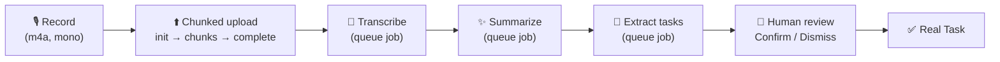
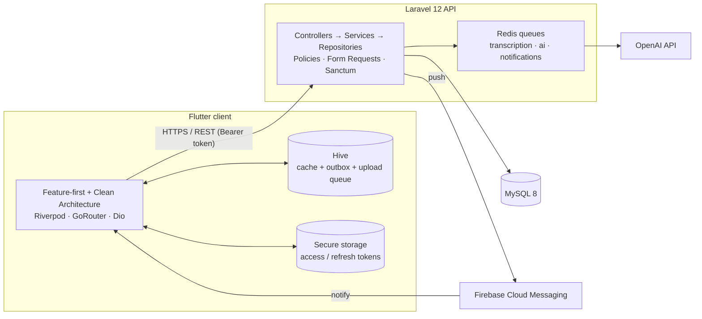
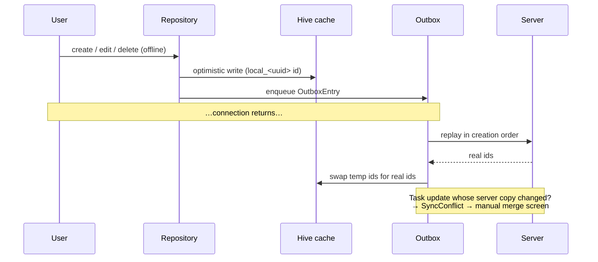

<div align="center">

# 🧠 MeetMind AI

### Record the meeting. Keep the decisions. Let AI chase the action items.

**AI-powered meeting notes & smart task management** — record a meeting and get a transcript, an executive summary, a mood read and suggested action items automatically, then manage everything as real tasks with your team.


<br>

</div>

---

## 📑 Table of contents

1. [What it does](https://github.com/bashii110/MeetMind/edit/main/README.md#-what-it-does)
2. [Screenshots](#-screenshots)
3. [Feature tour](#-feature-tour)
4. [How the AI pipeline works](#-how-the-ai-pipeline-works)
5. [Architecture](#-architecture)
6. [Offline-first & sync](#-offline-first--sync)
7. [Tech stack](#-tech-stack)
8. [Project structure](#-project-structure)
9. [Navigation map](#-navigation-map)
10. [API contract](#-api-contract-frontend--laravel)
11. [Getting started](#-getting-started)
12. [Configuration](#-configuration)
13. [Testing](#-testing)
14. [Security & privacy](#-security--privacy)
15. [Design system](#-design-system)
16. [Phase history](#-phase-history)
17. [Known simplifications](#-known-simplifications)
18. [Roadmap](#-roadmap)
19. [Author & license](#-author--license)

---

## ✨ What it does

Meetings produce decisions, and decisions get forgotten. **MeetMind AI** closes that gap:

1. **Record** a meeting on your phone (live waveform, pause/resume).
2. The audio uploads in the background — in chunks, resumable, even on flaky connections.
3. The backend **transcribes** it, then generates an **executive summary** with key points, decisions, risks, next steps, deadlines and an overall **mood**.
4. The AI proposes **task candidates**. You review, edit and *confirm* (or dismiss) each one before it becomes a real task — a human always stays in the loop.
5. Tasks live on a **Kanban board** with comments, attachments, progress and deadline reminders.
6. Teams share **workspaces** with roles, departments and an activity log.
7. An **in-meeting assistant** answers questions about the transcript ("Who owns each task?", "Draft a follow-up email").
8. Everything works **offline** and syncs when you're back online.

---

## 📱 Screenshots

Real screenshots from a physical Android device, in the app's glassmorphism theme (dark mode shown).

### Sign in & home

| Login | Dashboard | Calendar (week view) |
|:---:|:---:|:---:|
|  |  |  |
| Email/password + Google sign-in | Meetings preview, task stats, quick actions | Meetings and task deadlines, colour-coded |

### Inside a meeting

| Overview | Transcript | AI summary |
|:---:|:---:|:---:|
|  |  |  |
| Status, priority, record button, participants | Auto-generated transcript | Executive summary, meeting score, mood, key points, decisions, next steps |

| AI assistant | AI-suggested tasks | Files |
|:---:|:---:|:---:|
|  |  |  |
| Suggested prompts + free-form chat | Review → **Confirm** or **Dismiss** | Per-meeting attachments |

### Tasks, teams & insight

| Task list | Workspaces | Workspace details |
|:---:|:---:|:---:|
|  |  |  |
| Search, filter chips, deadline chips |  Every workspace you belong to | Overview · Members · Departments · Activity |


> 🎬 A short demo video (record → summary → confirm task → export → offline edit → sync) is planned for the v1.0.0 release.

---

## 🧩 Feature tour

### 🔐 Authentication & profile
- Email + password registration with a **6-digit OTP email verification** step (30-second resend cooldown).
- **Google Sign-In** (`google_sign_in` v7 API — singleton `initialize()` + `authenticate()`).
- Forgot / reset password via a **deep link** (`meetmindai://reset-password?token=…&email=…`).
- Access + refresh tokens in **`flutter_secure_storage`** (Keychain / Keystore); automatic refresh on `401`.
- Profile: name, bio, company, position, timezone, skills chips, avatar upload.
- Onboarding (3 swipeable slides), animated splash, router **auth guards**.

### 📅 Meetings
- Create / edit / delete with title, description, date, time, location, online link, category, priority, tags.
- Status flow: `draft → scheduled → completed | cancelled`.
- Invite participants by email (unknown emails are reported back); accept / decline invitations.
- List with search, status filter chips, infinite scroll pagination and pull-to-refresh.
- Six-tab details screen: **Overview · Transcript · Summary · Assistant · Tasks · Files**.
- Per-meeting **file attachments** (upload / list / delete).

### 🎙️ Recording & upload
- Live **waveform** (custom painter fed by the recorder's amplitude stream), timer, pause / resume / stop, discard confirmation.
- AAC-LC, 44.1 kHz, mono, 128 kbps (voice-optimised, small files).
- **Chunked, resumable upload** (512 KB chunks): `init → chunks → complete`. Before sending anything it reconciles with the server's `received_chunks`, so a killed app resumes exactly where it stopped.
- Queue persisted in Hive, retried on next launch / reconnect; upload banner with progress and retry on the meeting screen.

### 🤖 AI transcript, summary & task extraction
- Status **polling** (every 4 s, stops on a terminal state) with friendly processing / failed / empty states.
- **Transcript** tab (selectable text).
- **Summary** tab: executive summary, key points, decisions, risks, next steps, deadlines, **mood** badge (🙂 / 😐 / 😟), plus an **AI Meeting Score**.
- **Task candidates**: review, edit title / priority / deadline, then **Confirm** or **Dismiss** (SRD FR-6.3).

### 💬 In-meeting AI assistant
Chat over the meeting's transcript with one-tap prompts:
*Summarize this meeting · Who owns each task? · What's the next deadline? · Draft a follow-up email · Generate meeting minutes · Convert to a project plan.*
User and assistant bubbles, typing indicator, error bubbles, selectable answers.

### ✅ Task manager
- **Kanban board** (4 columns) on wide screens (≥ 800 px), **grouped list with filter chips** on phones.
- Filters: assigned to me, priority, status, search.
- Details: status chips, **progress slider**, assign-to-me / unassign, deadline, linked meeting, description.
- **Comments** (post / delete own) and **attachments** (upload / delete).
- Deadline chip: neutral → amber inside 24 h → red when overdue.

### 👥 Workspaces & collaboration
- Roles: **Owner · Admin · Member** (owner-only delete; everyone else can leave).
- Invite members by email with a role; change role; remove member.
- **Departments** (create / rename / delete) and department assignment.
- Paginated **activity timeline**.

### 🔍 Search · 🗓️ Calendar · 🔔 Notifications
- **Global search** (debounced 400 ms) across meetings, tasks and people, with filter chips, a "matched in …" label and recent searches.
- **Calendar**: Month / Week / Day views, colour-coded meetings vs. task deadlines, tap a day for its agenda.
- **Push notifications** via FCM (invitations, reminders, task assigned/completed, deadlines) with **deep-link routing** on tap, plus an in-app notification list with unread badge and "mark all read".

### 📊 Analytics & admin
- Workspace analytics: **productivity gauge**, average duration, time spent, active users, pending tasks, meetings-per-month **bar chart**, task-completion **donut**, department and top-contributor breakdowns (`fl_chart`).
- **Admin panel** (system admins only): platform stats, storage usage bar, user search + enable/disable, moderation queue (dismiss / remove content).

### 📤 Export, share & insights
- Export a summary as **PDF**, **Markdown** or **Word (.rtf)**, or share as plain text through the OS share sheet.
- **AI Meeting Score** (0–100 heuristic from mood, decisions, next steps, deadlines, risks; tap to see the factors).
- **Productivity tips** on the dashboard, computed client-side from your task stats and meeting load.

### 📡 Offline-first
Meetings and tasks are cached in Hive. Edits made offline are queued and replayed on reconnect. See [Offline-first & sync](#-offline-first--sync).

---

## 🔬 How the AI pipeline works



The client tracks the pipeline with one enum, mirrored from the backend:

| Status | Meaning | UI |
|---|---|---|
| `no_recording` | Nothing recorded yet | Empty state |
| `pending` / `uploading` / `uploaded` | Waiting / sending / queued for transcription | "Processing" state |
| `transcribing` | Speech-to-text running | Transcript tab waits |
| `transcribed` | Queued for summarization | Transcript + Assistant unlocked |
| `summarizing` | Summary being written | Summary tab waits |
| `summarized` | ✅ Everything ready | Summary + Task candidates unlocked |
| `failed` | Something broke | Error state with message |

The **Assistant** unlocks as soon as the transcript exists — it doesn't wait for the summary.

---

## 🏗️ Architecture



### Clean Architecture, per feature

```
features/<feature>/
├── domain/         # entities, repository interfaces, use cases  (pure Dart)
├── data/           # models (fromJson), datasources (Dio / Hive), repository impls
└── presentation/   # screens, widgets, Riverpod providers / controllers
```

Rules of thumb:
- **domain/** never imports Flutter or Dio.
- **data/** implements domain's repository interfaces using `core/network` (remote) and `core/storage` (local).
- **presentation/** depends on use cases, never on `data/` directly.
- One **use-case class per operation**; controllers are `AsyncNotifier` / `Notifier` (auto-dispose + `family` for per-id screens).
- Everything is **hand-written — no code generation** for the app's own models, so `build_runner` isn't required to run it.

### Error handling
Every API error is normalised into an `ApiFailure { message, statusCode, fieldErrors }` by an `ErrorMappingInterceptor`. Screens call `ApiFailure.from(error)` (which unwraps `DioException.error`) so validation errors and messages like *"account disabled"* always reach the user instead of collapsing into a generic message. `runOrNotify()` shows failures from fire-and-forget button actions in a SnackBar.

---

## 📡 Offline-first & sync



| Concern | Policy |
|---|---|
| **Reads** | Network first; fall back to the Hive cache on a connection error or when known-offline |
| **Writes** | Try the server; on a connection error, patch the cache and queue an `OutboxEntry` |
| **Replay order** | Oldest first; a pass **stops on the first failure** (later entries may depend on earlier ones) |
| **Meetings** | **Last-write-wins** |
| **Tasks** | **Manual merge** — if the server's `updated_at` moved past the moment the offline edit was made, it becomes a `SyncConflict` and you choose *Keep my changes* or *Keep server version* |
| **Triggers** | App start, reconnect, or tapping the sync chip |
| **UI** | Persistent **offline banner** + **sync chip** (spinner / pending badge / conflict badge) |

Recording uploads have their own persistent queue and resume independently.

---

## 🛠️ Tech stack

| Layer | Choices |
|---|---|
| **Client** | Flutter 3.x · Dart ≥ 3.4 |
| **State / DI** | `flutter_riverpod` 2.x |
| **Routing** | `go_router` (deep links, auth-guard redirect) |
| **Networking** | `dio` + auth & error-mapping interceptors, `pretty_dio_logger` (debug only) |
| **Local storage** | `hive` / `hive_flutter` (cache, outbox, upload queue) · `flutter_secure_storage` (tokens) |
| **Auth** | `google_sign_in` ^7 |
| **Audio** | `record` ^6 (AAC-LC) · `just_audio` · `audio_waveforms` |
| **Push** | `firebase_core` · `firebase_messaging` · `flutter_local_notifications` |
| **Charts** | `fl_chart` |
| **Export / share** | `pdf` · `share_plus` |
| **UI** | Material 3 · `google_fonts` (Inter) · `shimmer` skeleton loaders · custom glassmorphism widgets |
| **Files / media** | `file_picker` · `image_picker` |
| **Utilities** | `intl` · `equatable` · `uuid` · `connectivity_plus` · `path_provider` · `logger` |
| **Server** | Laravel 12 · PHP 8.3+ · MySQL 8 · Redis queues · Sanctum |
| **AI** | OpenAI (transcription, summarization, chat) |
| **Testing** | `flutter_test` with hand-written fakes (no mockito) |

---

## 🗂️ Project structure

```
meetmind_ai/
├── lib/
│   ├── main.dart                    # Firebase + Hive init, FCM wiring, startup sync, glass shell
│   ├── core/
│   │   ├── di/                      # dioProvider, tokenStorageProvider
│   │   ├── network/                 # api_client, interceptors, ApiFailure, connectivity controller
│   │   ├── storage/                 # Hive boxes, secure token storage
│   │   ├── router/                  # app_router (guards), app_routes, auth_status
│   │   ├── sync/                    # OutboxEntry, OutboxSyncManager, SyncConflict
│   │   ├── notifications/           # FcmService (register, foreground, tap routing)
│   │   ├── export/                  # SummaryExportService (PDF/MD/RTF), ShareService
│   │   ├── insights/                # meeting_score, productivity_tips
│   │   ├── theme/                   # AppTheme, GlassTokens, spacing
│   │   ├── utils/                   # runOrNotify error feedback
│   │   └── widgets/                 # glass_*, skeleton_loader, status_chip, offline_banner, …
│   └── features/
│       ├── auth/  profile/  meetings/  recording/  ai_summary/  ai status/  transcript/
│       ├── tasks/  calendar/  notifications/  workspace/  search/  analytics/  admin/
│       ├── sync/  dashboard/
│       └── <feature>/{domain,data,presentation}
├── test/                            # mirrors lib/ (unit, widget, Hive-backed integration)
├── assets/{images,icons,fonts}/
├── android/ ios/ web/ macos/ windows/ linux/
├── pubspec.yaml · analysis_options.yaml
├── README.md · CHANGELOG.md
└── PHASE5…PHASE12_README.md         # per-phase design notes
```

---

## 🧭 Navigation map

| Route | Screen |
|---|---|
| `/` | Splash |
| `/onboarding` · `/login` · `/register` | Pre-auth |
| `/otp-verification` | 6-digit email verification |
| `/forgot-password` · `/reset-password` | Password recovery (deep link) |
| `/dashboard` | Home |
| `/meetings` · `/meetings/new` | List · create |
| `/meetings/:id` · `/meetings/:id/edit` | Details (6 tabs) · edit |
| `/meetings/:id/record` | Recording |
| `/tasks` · `/tasks/new` | Board / list · create |
| `/tasks/:id` · `/tasks/:id/edit` | Details · edit |
| `/calendar` | Month / Week / Day |
| `/workspace` · `/workspace/new` | List · create |
| `/workspace/:id` · `/workspace/:id/edit` | Details (4 tabs) · edit |
| `/search` | Global search |
| `/analytics` | Workspace analytics |
| `/admin` | Admin panel (system admin) |
| `/notifications` | Notification list |
| `/profile` | Profile editor |
| `/sync/conflicts` | Manual merge for offline task edits |

**Guards:** unauthenticated users are redirected to onboarding/login; authenticated users are kept out of pre-auth screens. Tapping a push notification routes to the meeting, the task, or the notification list depending on its `type`.

---

## 🔌 API contract (frontend ↔ Laravel)

Base URL: `…/api/v1` · JSON · `Authorization: Bearer <token>` · success envelope `{ "data": … }` · paginated `{ "data": { "items": […], "meta": { current_page, last_page, total } } }` · errors `{ "message", "errors": { field: [..] } }`.

<details>
<summary><b>Auth & profile</b></summary>

| Method | Endpoint |
|---|---|
| POST | `/auth/register` · `/auth/verify-otp` · `/auth/resend-otp` |
| POST | `/auth/login` · `/auth/google` · `/auth/refresh` · `/auth/logout` |
| GET | `/auth/me` |
| POST | `/auth/forgot-password` · `/auth/reset-password` |
| GET · POST | `/profile` (multipart update, `skills[]`, `avatar`) |
</details>

<details>
<summary><b>Meetings, files & recording</b></summary>

| Method | Endpoint |
|---|---|
| GET · POST | `/meetings` |
| GET · PUT · DELETE | `/meetings/{id}` |
| PATCH | `/meetings/{id}/status` |
| POST | `/meetings/{id}/participants` · `/meetings/{id}/participants/respond` |
| DELETE | `/meetings/{id}/participants/{userId}` |
| GET · POST | `/meetings/{id}/files` |
| DELETE | `/meetings/{id}/files/{fileId}` |
| POST | `/meetings/{id}/recording/init` |
| POST | `/audio-files/{id}/chunks` (multipart `chunk_index`, `chunk`) |
| GET | `/audio-files/{id}/status` |
| POST | `/audio-files/{id}/complete` |
</details>

<details>
<summary><b>AI</b></summary>

| Method | Endpoint |
|---|---|
| GET | `/meetings/{id}/ai-status` · `/transcript` · `/summary` · `/task-candidates` |
| POST | `/task-candidates/{id}/confirm` · `/task-candidates/{id}/dismiss` |
| POST | `/meetings/{id}/assistant/query` — body `{ "query": "…" }` → `{ data: { answer } }` |

`/transcript` and `/summary` return **404 until generated**; the client treats that as "not ready yet", not an error.
</details>

<details>
<summary><b>Tasks</b></summary>

| Method | Endpoint |
|---|---|
| GET · POST | `/tasks` |
| GET · PUT · DELETE | `/tasks/{id}` |
| PATCH | `/tasks/{id}/status` · `/progress` · `/assign` |
| POST | `/tasks/{id}/comments` · `/tasks/{id}/attachments` |
| DELETE | `/tasks/{id}/comments/{cid}` · `/tasks/{id}/attachments/{aid}` |
</details>

<details>
<summary><b>Workspaces, calendar, search, analytics, notifications, admin</b></summary>

| Method | Endpoint |
|---|---|
| GET · POST | `/workspaces` · GET/PUT/DELETE `/workspaces/{id}` · POST `/workspaces/{id}/leave` |
| GET · POST | `/workspaces/{id}/members` · PATCH `/…/members/{userId}` · DELETE `/…/members/{userId}` |
| PATCH | `/workspaces/{id}/members/{userId}/department` |
| GET · POST · PUT · DELETE | `/workspaces/{id}/departments[/{deptId}]` |
| GET | `/workspaces/{id}/activity` · `/workspaces/{id}/analytics` |
| GET | `/calendar?start=YYYY-MM-DD&end=YYYY-MM-DD` → `{ meetings, task_deadlines }` |
| GET | `/search?q=` → `{ meetings, tasks, users }` |
| GET · POST | `/notifications` · POST `/notifications/{id}/read` · `/notifications/read-all` |
| POST · DELETE | `/device-tokens` |
| GET | `/admin/stats` · `/admin/users` · `/admin/moderation` |
| PATCH · POST | `/admin/users/{id}/disable` · `/admin/moderation/{id}/resolve` |
| GET | `/ping` (health check) |
</details>

---

## 🚀 Getting started

### Prerequisites
- Flutter 3.x (Dart ≥ 3.4) and an Android device/emulator or iOS simulator
- The **MeetMind Laravel API** running and reachable from the device
- A Firebase project (for push notifications) and a Google Cloud OAuth client (for Google Sign-In)

### Run it

```bash
git clone <your-repo-url> meetmind_ai
cd meetmind_ai

flutter pub get

# Point the app at your API (see Configuration below)
flutter run --dart-define=API_BASE_URL=http://<your-ip>:8000/api/v1
```

The platform folders (`android/`, `ios/`, `web/`, `macos/`, `windows/`, `linux/`) are included. If you ever need to regenerate them:

```bash
flutter create --project-name meetmind_ai --platforms android,ios .
```

`build_runner` is **not** required to run the app — the app's own models are hand-written. (It's only needed if you enable the optional codegen packages listed in `pubspec.yaml`.)

### Release build

```bash
flutter build appbundle --release --obfuscate --split-debug-info=build/symbols \
  --dart-define=API_BASE_URL=https://api.your-domain.com/api/v1
```

---

## ⚙️ Configuration

### API base URL
Resolved at build time from `--dart-define`:

```bash
flutter run --dart-define=API_BASE_URL=http://192.168.0.104:8000/api/v1
```

Default (in `core/network/api_client.dart`): `http://192.168.0.104:8000/api/v1`.

| Where the API runs | URL to use |
|---|---|
| Android emulator → your machine | `http://10.0.2.2:8000/api/v1` |
| Physical device on the same Wi-Fi | `http://<your-LAN-IP>:8000/api/v1` |
| Production | `https://your-domain/api/v1` (HTTPS only) |

### Firebase (push notifications)
1. Create a Firebase project and register the Android / iOS apps (`com.buxhiisd.meet_mind_ai`).
2. Add `android/app/google-services.json` and `ios/Runner/GoogleService-Info.plist`.
3. Generate `lib/firebase_options.dart` with `flutterfire configure`.

These three files are **git-ignored**. Without them the app still runs — Firebase init is wrapped in a `try/catch` and push is simply unavailable.

### Google Sign-In
Pass the OAuth client id at build time and set the server client id used by the backend to verify the token:

```bash
flutter run --dart-define=GOOGLE_CLIENT_ID=<ios-client-id> …
```

The Android/iOS client setup follows the `google_sign_in_android` / `google_sign_in_ios` package guides.

### Permissions
- **Android:** `RECORD_AUDIO`, `POST_NOTIFICATIONS` (declared in `AndroidManifest.xml`)
- **iOS:** `NSMicrophoneUsageDescription` (declared in `Info.plist`)

---

## 🧪 Testing

```bash
flutter test
```

| Type | What's covered |
|---|---|
| **Unit** | `ApiFailure.from` unwrapping, `OutboxEntry` / `SyncConflict` / `PendingUpload` JSON round-trips, `TaskFilters` / `MeetingFilters` query mapping (incl. "clear flag wins"), `AiStatus` getters + labels, `MeetingScore`, `buildProductivityTips` |
| **Widget** | `StatusChip`, `PriorityIndicator`, `EmptyState`, `DeadlineChip`, `OfflineBanner` (online/offline), `LoginScreen` (error display), `SplashScreen` smoke test |
| **Integration-style** | `SyncStatusChip` against a **real temp-dir Hive store** (empty / pending / conflict); `TasksListController` and `MeetingsListController` against hand-written fake repositories (initial load, pagination guards, filters, error path) |

Tests use hand-rolled fakes (`FakeTaskRepository`, `FakeMeetingRepository`, `FixedAuthController`) — no mocking library.

```bash
flutter analyze
```

A full-app boot test belongs in `integration_test/` where platform channels can be mocked end to end.

---

## 🔒 Security & privacy

| Area | Approach |
|---|---|
| **Tokens** | Stored in `flutter_secure_storage` (Keychain / Keystore), never in shared preferences |
| **Logging** | `PrettyDioLogger` only in non-product builds; every `debugPrint` in `FcmService` is gated behind `kDebugMode` so notification content never reaches release logs |
| **Session** | Bearer tokens via `AuthInterceptor`; `401` triggers a refresh attempt, otherwise sign-out |
| **Account switching** | Cached providers (meetings, notifications, profile, workspaces) `watch` the signed-in user id so a new login never sees the previous user's data |
| **Roles** | UI gates (admin screen, workspace actions) are UX only — enforcement is the backend's Policies |
| **Secrets** | `google-services.json`, `GoogleService-Info.plist`, `firebase_options.dart`, `.env`, keystores are git-ignored |
| **Recommended before production** | HTTPS-only + Android `network_security_config.xml` (`usesCleartextTraffic="false"`), release obfuscation, committed `pubspec.lock`, a real release signing config |

---

## 🎨 Design system

- **Glassmorphism**: `GlassBackground` paints an ambient gradient with blurred colour blobs once behind the whole app; `GlassContainer`, `GlassCard`, `GlassAppBar` and the theme's translucent cards/dialogs/sheets frost whatever is behind them.
- **Tokens** (`GlassTokens`): blur 12 / 24, radii 14 / 20 / 28, separate light/dark fill and border opacities.
- **AI signal colour**: a distinct teal `tertiary` (`#14CFC0`) marks anything AI-generated — summary card, assistant bubbles, suggested tasks, score badge — so you can always tell AI output from human input. Brand seed: `#5B5FEF`.
- **Light + dark** via `ThemeMode.system`, Inter typography, Material 3.
- **Loading & empty states**: shimmer **skeleton loaders**, illustrated empty states, `AnimatedSwitcher` fades.
- **Accessibility**: system font scaling respected, 48 dp touch targets.

---

## 🗓️ Phase history

| Phase | Delivered |
|:---:|---|
| 0 | Project scaffold, Riverpod / GoRouter / Dio / Hive base, `/ping` connectivity check |
| 1 | Auth (email + OTP + Google), profile, onboarding, splash |
| 2 | Meetings CRUD, participant invites, basic notifications |
| 3 | Audio recording, chunked & resumable background upload |
| 4 | AI transcription → summary → task-suggestion pipeline UI |
| 5 | Full task management (Kanban, comments, attachments, progress) |
| 6 | Push notifications (FCM), calendar |
| 7 | Workspaces, roles, departments, activity log |
| 8 | In-meeting AI assistant, global search |
| 9 | Analytics dashboard, admin panel |
| 10 | Offline support: Hive cache, outbox, conflict resolution |
| 11 | Test suite, security review, cross-device audit |
| 12 | UI polish, export & share, bonus AI features, launch prep |

Per-phase design notes live in `PHASE5_README.md` … `PHASE12_README.md`; a condensed history is in `CHANGELOG.md`.

---

## ⚠️ Known simplifications

- **Offline** covers meetings/tasks core CRUD + status. Participant invites, comments, attachments, progress and assignment stay online-only.
- The cache doesn't round-trip participants, comments or attachments, and offline list reads ignore filters.
- No exponential back-off on outbox retries (`retryCount` / `lastError` are tracked for future UI).
- **"Word" export is RTF**, not `.docx` — it opens natively in Word / Google Docs.
- **Assistant chat history** and **recent searches** are session-only.
- **Meeting Score** and **productivity tips** are client-side heuristics, not extra AI calls.
- Assignment is *assign to me / unassign* (there's no member-picker endpoint for tasks yet).
- Unlinking a meeting from an existing task isn't exposed in the edit form.
- Skeleton loaders are applied to the meetings and notifications lists; other lists still use a spinner.
- Ownership transfer, @mentions in comments and shared workspace files aren't implemented.

---

## 🛣️ Roadmap

- [ ] Demo video + final screenshot pass, then tag **v1.0.0**
- [ ] Backend deployment (Railway / Render / VPS), production hardening, HTTPS + certificate pinning
- [ ] Real `.docx` export
- [ ] Persist assistant chat history server-side
- [ ] Offline support for comments, progress and assignment
- [ ] Task assignee picker (workspace members)
- [ ] Voice commands, OCR, AI translation, speech-emotion analysis
- [ ] CI/CD (analyze + test on every push)
- [ ] Localisation / RTL support

---

##  Author & license

Built by **Bashir Ahmed** — [github.com/bashii110](https://github.com/bashii110)

Portfolio project. License to be chosen by the project owner before the public release tag.

<div align="center">

**If MeetMind AI made you curious, a ⭐ on the repo means a lot.**

</div>

